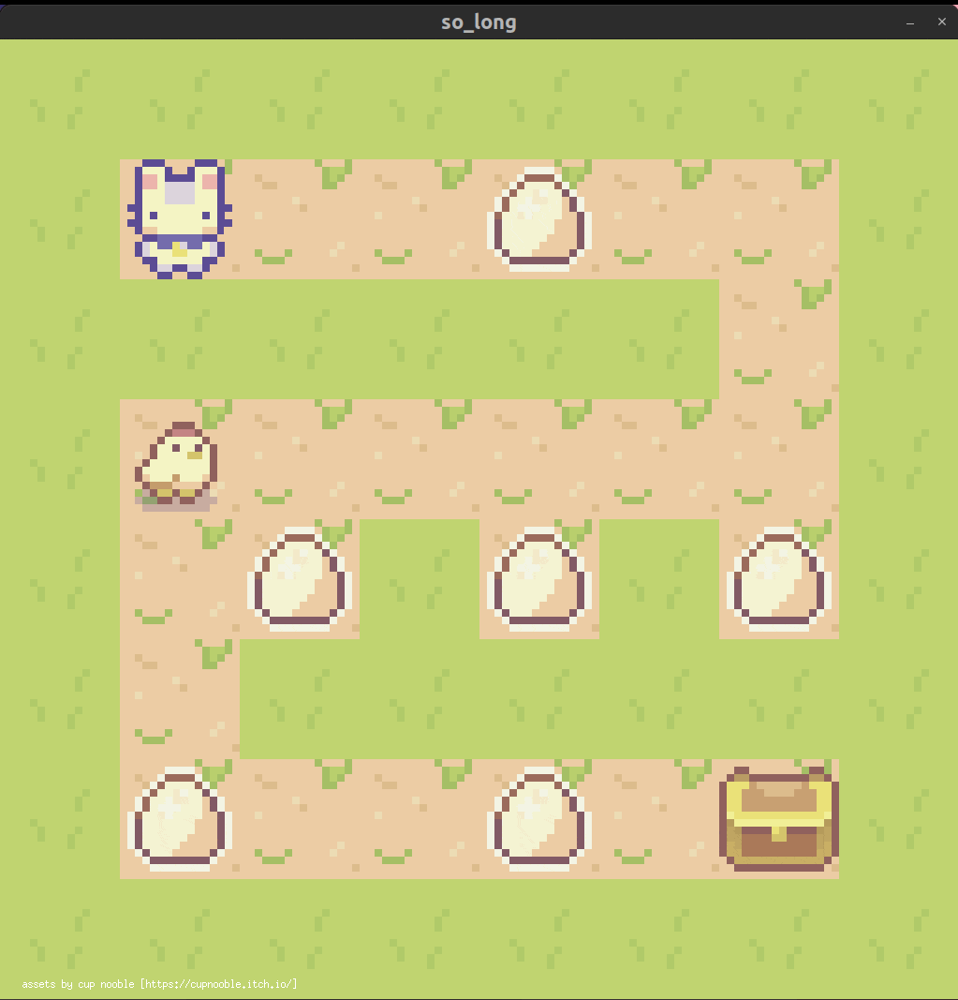
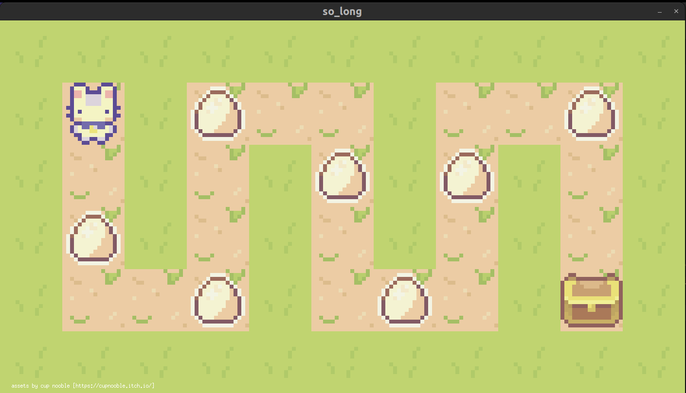

# so_long 
this was my first graphical project in 42 curriculum. 

## description
so_long is a small 2d game, created using the MiniLibX graphics library.
we get familiar with mlx and work with textures, sprites, and some other very basic gameplay elements.
the player’s goal is to collect every collectible present on the map, then escape chosing the shortest possible route.

## MiniLibX
the minilibx is a C library used for rendering graphics, primarily used by 42 students.
this library is built on top of the X Window System API, to provide a simple programming interface suited for beginners.

these are some resouurces i used, in case you wanna get familiar with it:

• [42docs - MiniLibX](https://harm-smits.github.io/42docs/libs/minilibx);

• [getting started with the minilibx](https://aurelienbrabant.fr/blog/getting-started-with-the-minilibx);

• [pixel drawing with the minilibx](https://aurelienbrabant.fr/blog/pixel-drawing-with-the-minilibx);

## how to run so_long
1. clone this repository: `git clone git@github.com:idleira/so_long.git so_long`
2. all of the following commands should be run in the root of the directory: `cd so_long`;
3. this project is divided in 2, mandatory and bonus, parts.
   • to run **mandatory** (basic character movement and item collecting) part, use `make`;
   • to run **bonus** (on-screen move counter and enemy patrol) part, use `make bonus`.
4. run the game with a map of your choosing from /maps: `./so_long maps/map1.ber`

## maps

i provided some valid and invalid maps in the maps folder, however you're welcome to create your own.
the program will run any map as long as it passes all the requirements:
1. map file has to end with the .ber extension;
2. the only valid characters are:
   ◦ `P` (player);
   ◦ `1` (wall);
   ◦ `0` (empty cell);
   ◦ `C` (collectible);
   ◦ `E` (exit);
   ◦ `V` (enemy in bonus).
3. there must be ONE exit, ONE player, and at least one collectible on the map;
4. map must be rectangular, i.e. all rows must have the same length;
5. map must be closed, i.e. surrounded by walls.

## my final grade:

